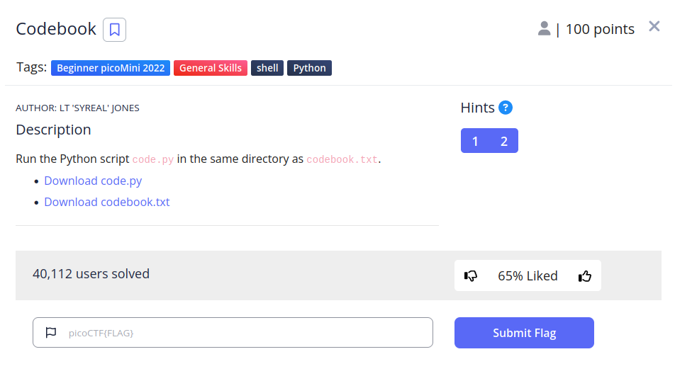
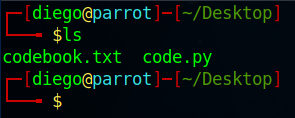
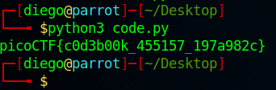

# Codebook


## Descripción
Run the Python script code.py in the same directory as codebook.txt.
- [Download code.py](https://artifacts.picoctf.net/c/3/code.py)
- [Download codebook.txt](https://artifacts.picoctf.net/c/3/codebook.txt)

## Resolucion
Descargamos ambos archivos y nos aseguramos de que estén en la misma carpeta con 'ls':



Introducimos el siguiente comando para ejecutar el programa de python:

```
python3 code.py
```

Y obtenemos el siguiente resultado:



Consiguiendo así la flag: 'picoCTF{c0d3b00k_455157_197a982c}'.