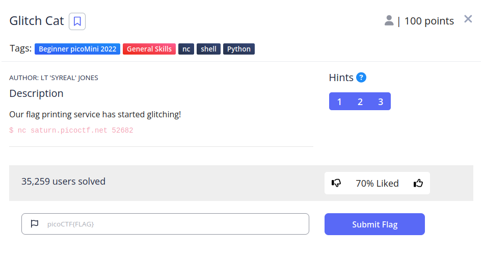

# Glitch Cat


## Descripción
Our flag printing service has started glitching!
`$ nc saturn.picoctf.net 52682`

## Resolucion
Nos conectamos al servicor con el comando proporcionado:


Y obtenemos esto:

```
'picoCTF{gl17ch_m3_n07_' + chr(0x62) + chr(0x64) + chr(0x61) + chr(0x36) + chr(0x38) + chr(0x66) + chr(0x37) + chr(0x35) + '}'
```

chr() es una función de python que devuelve el caracter representado por el unicode que se le proporcione. En este aso el unicode parece estar escrito en hexadecimal por el 0x.

Podemos usar python para traducir la flag rápidamente. Iniciamos la consola de python con el siguiente comando:

```
python
```

Y pegamos la información dada por el servidor:


Obteniendo así la flag: 'picoCTF{gl17ch_m3_n07_bda68f75}'.