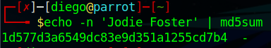

# HashingJobApp


## Descripción
If you want to hash with the best, beat this test!
`nc saturn.picoctf.net 53638`

## Resolucion
Nos conectamos al servicor con el comando proporcionado:

Y obtenemos esto:


Para hacer el checksum podemos utilizar el terminal de Parrot:

```
echo -n 'Jodie Foster' | md5sum
```

Con este comando lo que hacemos es imprimir Jodie Foster y pasárselo como entrada al comando md5sum, que calculará su hash MD5. Al ejecutarlo obtendremos el siguiente resultado



El servidor nos pedirá dos hashes más. Tras calcularlos nos dará la flag:


Finalizando el CTF con la flag: 'picoCTF{4ppl1c4710n_r3c31v3d_bf2ceb02}'