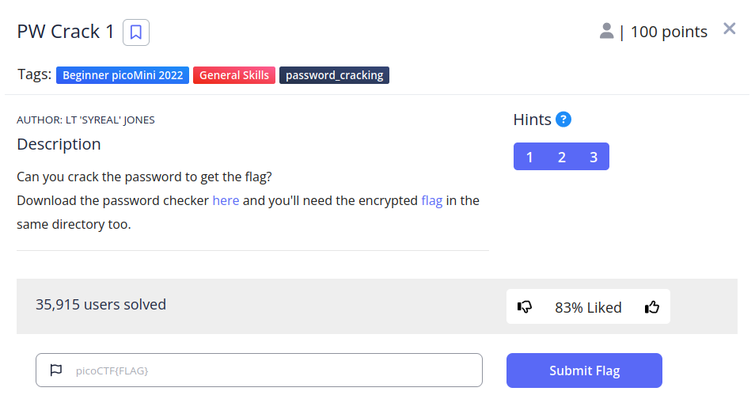
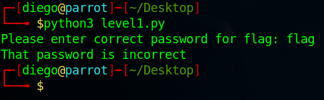
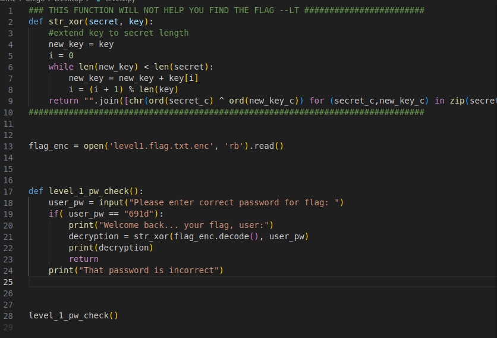
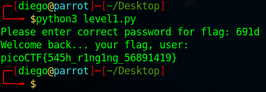

# PW Crack 1


## Descripción
Can you crack the password to get the flag? Download the password checker [here](https://artifacts.picoctf.net/c/10/level1.py) and you'll need the encrypted [flag](https://artifacts.picoctf.net/c/10/level1.flag.txt.enc) in the same directory too.

## Resolucion
Nos descargamos los dos archivos y ejecutamos el script de python:



Nos pide una contraseña para poder desencriptar la flag.

Abrimos el archivo de python para ver si encontramos algo interesante:



Se realiza una comprobación de lo que introduce el usuario con '691d':

```
    if( user_pw == "691d"):
        print("Welcome back... your flag, user:")
```

Probamos a introducirlo en el programa:



Y obtenenmos la flag: 'picoCTF{545h_r1ng1ng_56891419}'.