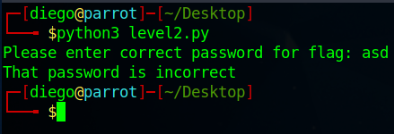

# PW Crack 2


## Descripción
Download the password checker [here](https://artifacts.picoctf.net/c/15/level2.py) and you'll need the encrypted [flag](https://artifacts.picoctf.net/c/15/level2.flag.txt.enc) in the same directory too.

## Resolucion
Nos descargamos los dos archivos y ejecutamos el script de python:



Nos pide de nuevo una contraseña para poder desencriptar la flag.

Abrimos el archivo de python para ver si encontramos algo interesante:


Se realiza una comprobación de lo que introduce el usuario con 'chr(0x33) + chr(0x39) + chr(0x63) + chr(0x65)':

```
user_pw = input("Please enter correct password for flag: ")
if( user_pw == chr(0x33) + chr(0x39) + chr(0x63) + chr(0x65) ):
```

Ya vimos en el CTF de [Glitch Cat](https://github.com/Diego-san-2000/Beginner_picoMini_2022/tree/main/General%20Skills/Glitch%20Cat) lo que significan estas funciones. Se encargan de transformar el número proporcionado, en este caso un número hexadecimal, en el carácter que ocupa su lugar en unicode.

Para poder ver la contraseña, abrimos una consola de python con el comando 'python':

```
python
```

E introducimos la cadena de caracteres:


Obtenemos como resultado '39ce'. Lo introducimos como contraseña:


Y obtenenmos la flag: 'picoCTF{tr45h_51ng1ng_502ec42e}'.