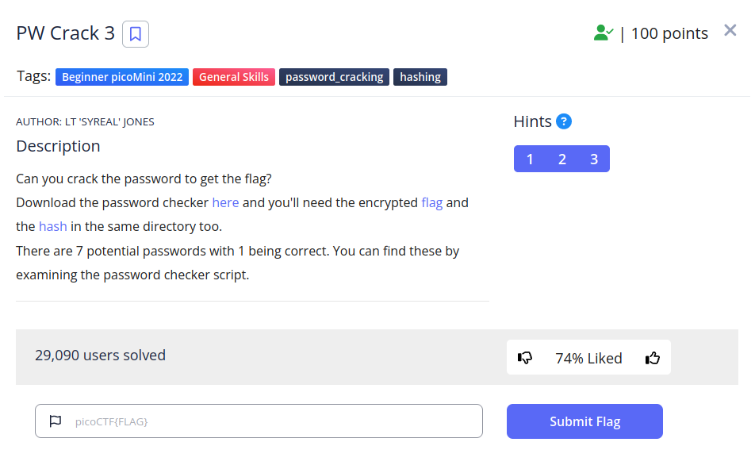
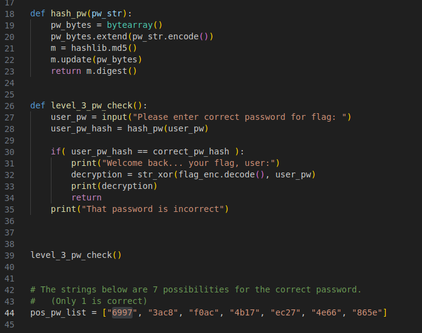
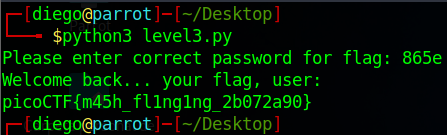

# PW Crack 3

## Descripción
Can you crack the password to get the flag? Download the password checker [here](https://artifacts.picoctf.net/c/16/level3.py) and you'll need the encrypted [flag](https://artifacts.picoctf.net/c/16/level3.flag.txt.enc) and the [hash](https://artifacts.picoctf.net/c/16/level3.hash.bin) in the same directory too. There are 7 potential passwords with 1 being correct. You can find these by examining the password checker script.

## Resolucion
Nos descargamos los dos archivos y ejecutamos el script de python:

Abrimos el archivo de python para ver si encontramos algo interesante:

Como no hay forma de deshacer un hash, tendremos que ir probando las 7 soluciones dadas una a una.
Al ser tan pocas, no es necesario hacer un script de python que automatice el proceso.

Al probar con la última obtendremos la flag: 'picoCTF{m45h_fl1ng1ng_2b072a90}'.