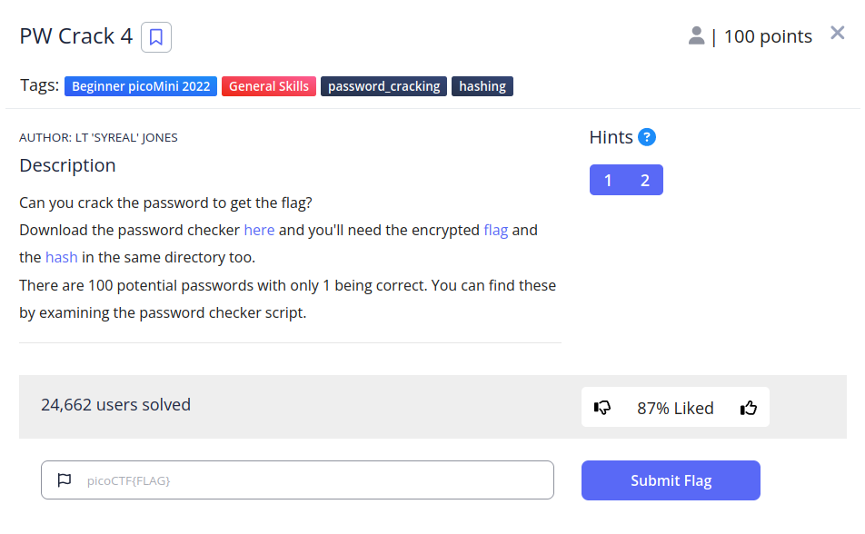

# PW Crack 4


## Descripción
Can you crack the password to get the flag? Download the password checker [here](https://artifacts.picoctf.net/c/19/level4.py) and you'll need the encrypted [flag](https://artifacts.picoctf.net/c/19/level4.flag.txt.enc) and the [hash](https://artifacts.picoctf.net/c/19/level4.hash.bin) in the same directory too. There are 100 potential passwords with only 1 being correct. You can find these by examining the password checker script.

## Resolucion
Abrimos el archivo 'level4.py' y extraemos todas las posibles contraseñas:

```
pos_pw_list = ["6288", "6152", "4c7a", "b722", "9a6e", "6717", "4389", "1a28", "37ac", "de4f", "eb28", "351b", "3d58", "948b", "231b", "973a", "a087", "384a", "6d3c", "9065", "725c", "fd60", "4d4f", "6a60", "7213", "93e6", "8c54", "537d", "a1da", "c718", "9de8", "ebe3", "f1c5", "a0bf", "ccab", "4938", "8f97", "3327", "8029", "41f2", "a04f", "c7f9", "b453", "90a5", "25dc", "26b0", "cb42", "de89", "2451", "1dd3", "7f2c", "8919", "f3a9", "b88f", "eaa8", "776a", "6236", "98f5", "492b", "507d", "18e8", "cfb5", "76fd", "6017", "30de", "bbae", "354e", "4013", "3153", "e9cc", "cba9", "25ea", "c06c", "a166", "faf1", "2264", "2179", "cf30", "4b47", "3446", "b213", "88a3", "6253", "db88", "c38c", "a48c", "3e4f", "7208", "9dcb", "fc77", "e2cf", "8552", "f6f8", "7079", "42ef", "391e", "8a6d", "2154", "d964", "49ec"]
```

Ahora crearemos un script de python que las pruebe todas con fuerza bruta.

```
import hashlib

def hash_pw(pw_str):
    pw_bytes = bytearray()
    pw_bytes.extend(pw_str.encode())
    m = hashlib.md5()
    m.update(pw_bytes)
    return m.digest()

correct_pw_hash = open('level4.hash.bin', 'rb').read()
pos_pw_list = ["6288", "6152", "4c7a", "b722", "9a6e", "6717", "4389", "1a28", "37ac", "de4f", "eb28", "351b", "3d58", "948b", "231b", "973a", "a087", "384a", "6d3c", "9065", "725c", "fd60", "4d4f", "6a60", "7213", "93e6", "8c54", "537d", "a1da", "c718", "9de8", "ebe3", "f1c5", "a0bf", "ccab", "4938", "8f97", "3327", "8029", "41f2", "a04f", "c7f9", "b453", "90a5", "25dc", "26b0", "cb42", "de89", "2451", "1dd3", "7f2c", "8919", "f3a9", "b88f", "eaa8", "776a", "6236", "98f5", "492b", "507d", "18e8", "cfb5", "76fd", "6017", "30de", "bbae", "354e", "4013", "3153", "e9cc", "cba9", "25ea", "c06c", "a166", "faf1", "2264", "2179", "cf30", "4b47", "3446", "b213", "88a3", "6253", "db88", "c38c", "a48c", "3e4f", "7208", "9dcb", "fc77", "e2cf", "8552", "f6f8", "7079", "42ef", "391e", "8a6d", "2154", "d964", "49ec"]

for i in pos_pw_list:
    hash = hash_pw(i)
    if(hash == correct_pw_hash):
        print("La contraseña es: {}".format(i))
        break
```

Al ejecutarlo en el mismo directorio que el resto de archivos obtendremos el siguiente resultado:


Y al probar la contraseña en el programa:


Obtendremos la flag: 'picoCTF{fl45h_5pr1ng1ng_ae0fb77c}'.
