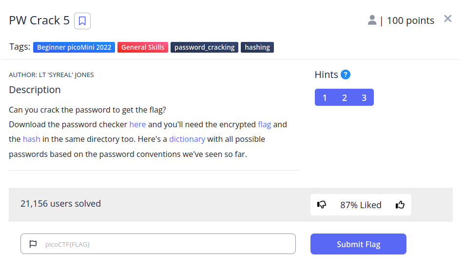
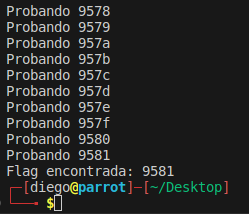

# PW Crack 3


## Descripción
Can you crack the password to get the flag? Download the password checker [here](https://artifacts.picoctf.net/c/31/level5.py) and you'll need the encrypted [flag](https://artifacts.picoctf.net/c/31/level5.flag.txt.enc) and the [hash](https://artifacts.picoctf.net/c/31/level5.hash.bin) in the same [directory](https://artifacts.picoctf.net/c/31/dictionary.txt) too. Here's a dictionary with all possible passwords based on the password conventions we've seen so far.

## Resolucion
Nos descargamos los cuatro archivos y les echamos un vistazo:

- dictionary.txt: Lo componen todas las combinaciones posibles  de 4 caracteres hexadecimales, desde 0000 hasta ffff.
- level5.py: Funciona exactamente igual que level4.py, hay que introducir la contraseña para obtener la flag, si no es imposible poder verla.
- level5.flag.txt.enc: Es la flag codificada.
- level5.hash.bin: Es el hash de la flag.

Si el hash de la contraseña introducida es correcto, se usará la contraseña para descifrar la flag.

Tendremos que volver a hacer un script de python que pruebe todas las posibles contraseñas:

```
import hashlib

flag_enc = open('level5.flag.txt.enc', 'rb').read()
correct_pw_hash = open('level5.hash.bin', 'rb').read()

def hash_pw(pw_str):
    pw_bytes = bytearray()
    pw_bytes.extend(pw_str.encode())
    m = hashlib.md5()
    m.update(pw_bytes)
    return m.digest()

with open("dictionary.txt","r") as diccionario:
    for line in diccionario:
        clave = line.strip(" \n")
        print("Probando {}".format(clave))
        if( hash_pw(clave) == correct_pw_hash ):
            print("Flag encontrada: {}".format(clave))
            break
```

Ejecutar el programa anterior en el mismo directorio que los archivos descargados dará el siguiente resultado:



Al probar la clave en el programa 'level5.py' obtendremos el siguiente resultado:


Así conseguiremos la flag: 'picoCTF{h45h_sl1ng1ng_36e992a6}'.