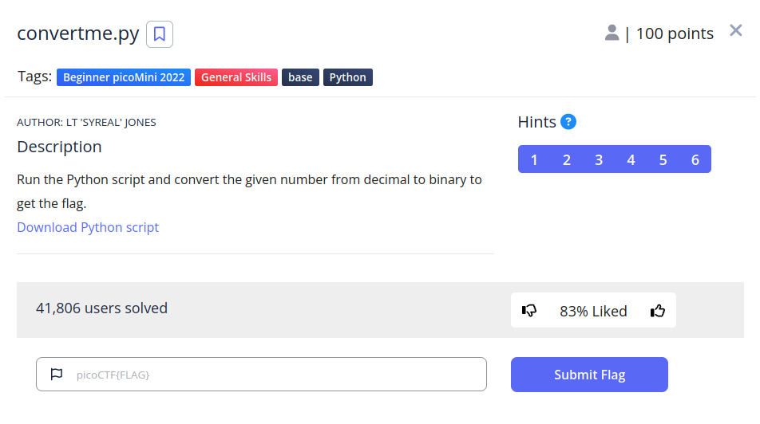
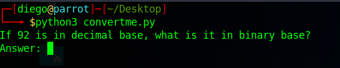
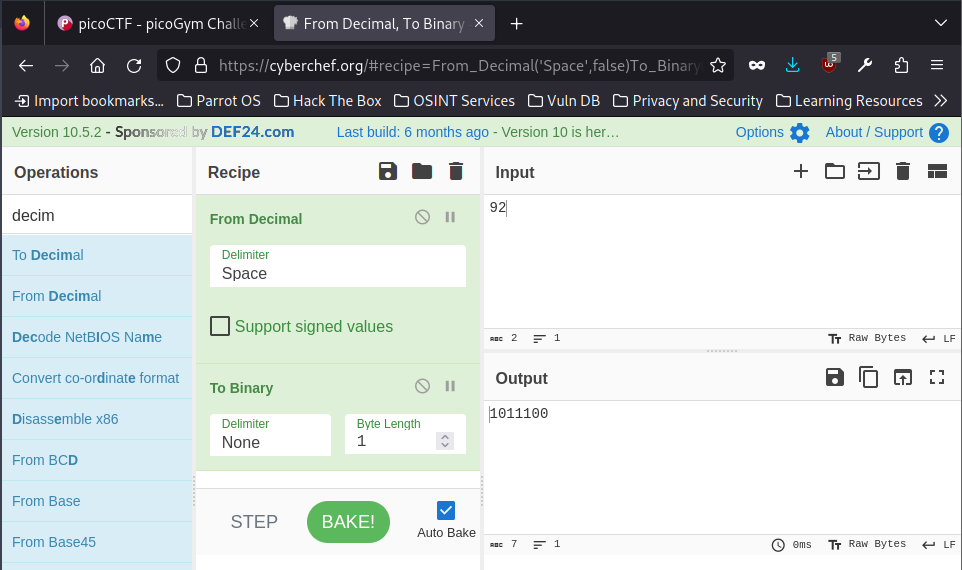
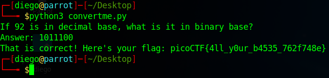

# convertme.py


## Descripción
Run the Python script and convert the given number from decimal to binary to get the flag.
[Download Python script](https://artifacts.picoctf.net/c/22/convertme.py)

## Resolucion
Descargamos el archivo y lo ejecutamos con el siguiente comando.

```
python3 convertme.py
```



Acudimos a [Cybercheff](https://cyberchef.org/) e introducimos la siguiente receta (es importante modificar el 'To Binary' para que no tenga delimitadores y su longitud de byte sea la mínima posible):



Volvemos al terminal e introducimos el número:



Obteniendo así la flag: 'picoCTF{4ll_y0ur_b4535_762f748e}'.
