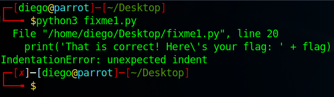

# fixme1.py


## Descripción
Fix the syntax error in this Python script to print the flag.
[Download Python script](https://artifacts.picoctf.net/c/27/fixme1.py)

## Resolucion
Descargamos el archivo y lo ejecutamos con el siguiente comando.

```
python3 fixme1.py
```



Como podemos ver, se trata de un error de identación en la línea 20. Esto quiere decir que hay un problema con las tabulaciones en esa línea. Abrimos el archivo con VSCodium:

```
codium fixme.py
```

Y vemos que la línea 20 está tabulada:


Arreglamos el error:


Y al ejecutar el programa de nuevo funciona correctamente:


Obteniendo así la flag: 'picoCTF{1nd3nt1ty_cr1515_182342f7}'.