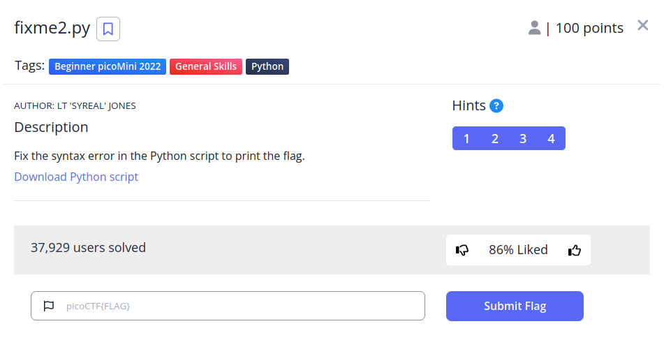
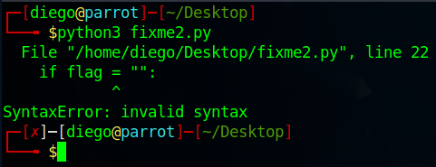

# fixme2.py


## Descripción
Fix the syntax error in the Python script to print the flag.
[Download Python script](https://artifacts.picoctf.net/c/4/fixme2.py)

## Resolucion
Descargamos el archivo y lo ejecutamos con el siguiente comando.

```
python3 fixme2.py
```



Esta vez se trata de un error de asignación. Al estar en un if, el programa espera una comparación entre dos variables (==), pero tenemos una asignación (=). Abrimos codium para arreglar el error:

```
codium fixme2.py
```