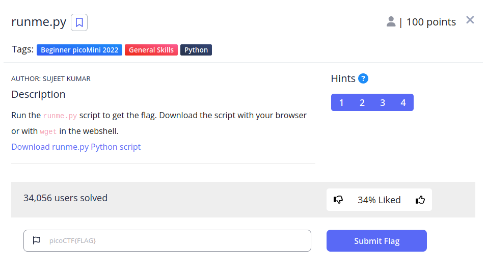
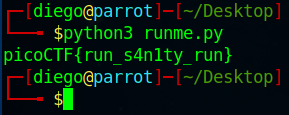

# runme.py


## Descripción
Run the runme.py script to get the flag. Download the script with your browser or with wget in the webshell. [Download runme.py Python script](https://artifacts.picoctf.net/c/34/runme.py)

## Resolucion
Nos descargamos el archivo y lo ejecutamos con el siguiente comando:

```
python3 runme.py
```

Nos dará el siguiente resultado:



Obteniendo así la flag: 'picoCTF{run_s4n1ty_run}'.